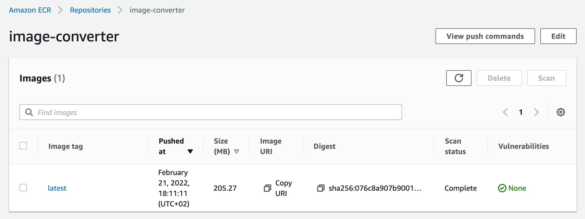
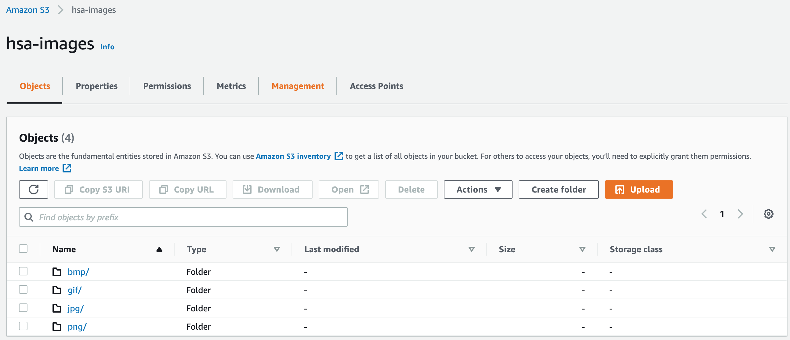
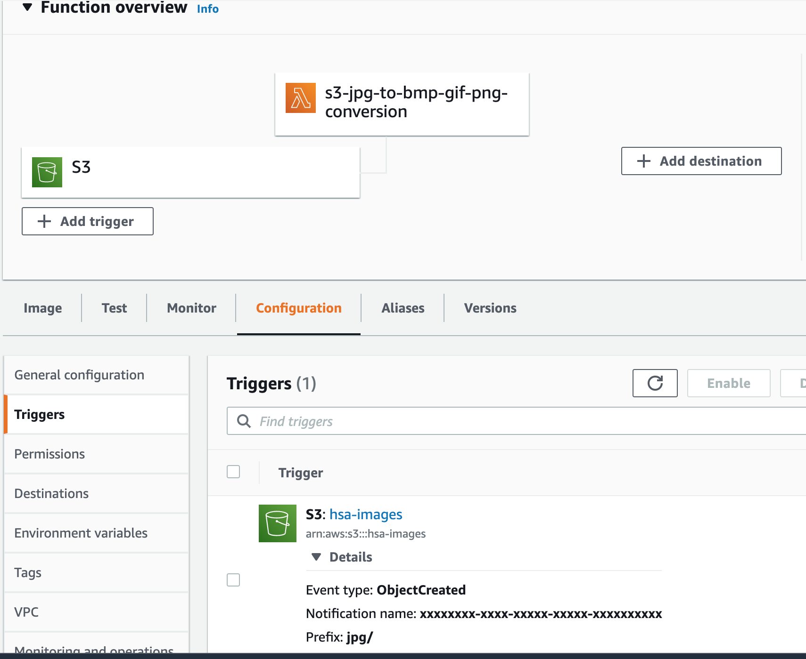
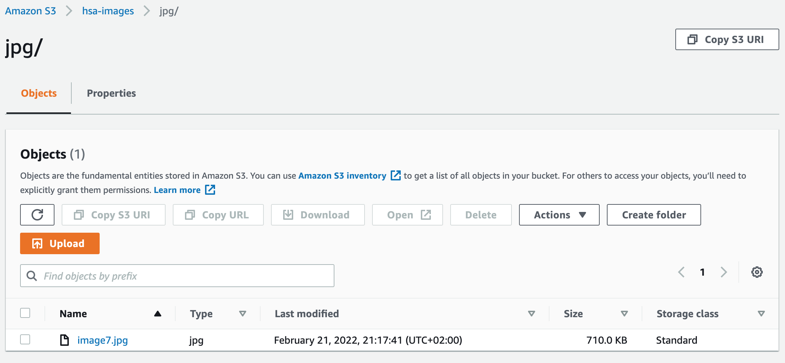
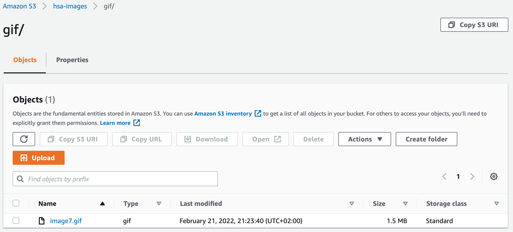
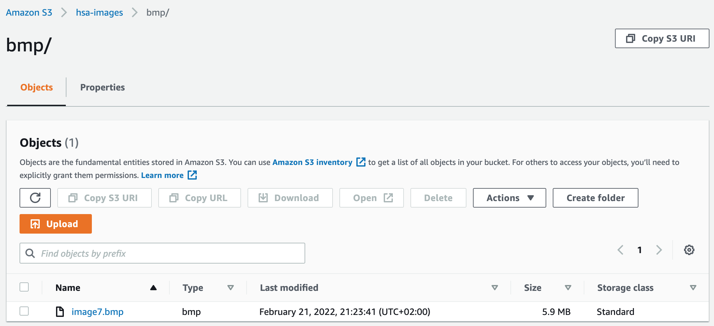

# HSA L26: AWS Serverless Calculations

## Task
* Create Lambda function that will convert JPEG to BMP, GIF, PNG.

## Getting Started

### 1. Create script that will convert JPEG image to BMP, GIF, and PNG formats.

### 2. Deploy script to ECR

Retrieve an authentication token and authenticate your Docker client to your registry.
Use the AWS CLI:
```bash
$ aws ecr get-login-password --region region-name | docker login --username AWS --password-stdin 00000000000.dkr.ecr.region-name.amazonaws.com
```

Build Docker image using the following command:
```bash
$ docker build -t image-converter .
```

After the build completes, tag your image, so you can push the image to this repository:
```bash
$ docker tag image-converter:latest 00000000000.dkr.ecr.region-name.amazonaws.com/image-converter:latest
```

Run the following command to push this image to your newly created AWS repository:
```bash
$ docker push 00000000000.dkr.ecr.region-name.amazonaws.com/image-converter:latest
```



### 3. Create S3 bucket with 4 folders: jpg, png, gif, and bmp.


### 4. Create lambda function that is triggered by S3 'ObjectCreated' event


## Test

### Upload the file image7.jpg to jpg folder in 'hsa-images' bucket.



### In a minute we see images in PNG, BMP, and GIF folder that were created from original JPG image.

PNG


GIF


BMP
